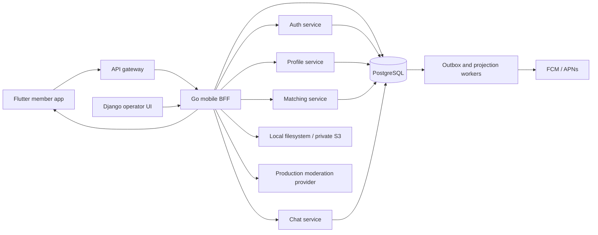

# Connect — Consolidated Functional Requirements

Document: FRD-CONNECT-001 · Version: 1.1 · Review date: 2026-09-26 · Rows added: 2026-09-27  
Status: Working consolidation; unresolved product decisions remain explicitly open.  
Perspective: Product management and software architecture.

This document consolidates the five available BRDs, the profile-details BA specification, engagement and economy plans, current native PostgreSQL architecture documents, and implementation/QA reports. “Connect”, “AegisConnect”, and “Verified Dating App” are treated as names for the same product; the public brand remains an open decision. No source document is deleted or retrospectively approved.

Read alongside the [product and architecture review](PRODUCT_ARCHITECTURE_REVIEW.md), [requirements traceability](REQUIREMENTS_TRACEABILITY.md), and [source register](DOCUMENT_SOURCE_REGISTER.md). Original screen-level acceptance cases remain linked through traceability; this document replaces their conflicting assumptions with the explicit interpretations below.

## 1. Authority, evidence, and boundaries

Authority is determined by topic and explicit decisions, not filenames or a “completed” folder:

1. Current identity/security, native runtime, media, notification, admin, reliability, and progression decisions govern those domains.
2. BRDs govern business intent where not superseded. Implementation reports establish reported delivery evidence, not automatic product approval.
3. Current OpenAPI is the API reference. The March contract snapshot is historical.
4. Brainstorms, old sprint estimates, seed examples, and local test passes do not establish production commitments.
5. Where documents still disagree, the decision register governs the unresolved item. Recommendations in the companion review are proposals, not implemented behavior.

Requirement evidence labels:

| Label | Meaning |
|---|---|
| D | Documented current local behavior; reports say implemented. Not independently retested by this documentation review. |
| R | Retained source requirement; complete implementation/acceptance is not established. |
| G | Explicit implementation or production release gap. |
| P | Proposed clarification or addition from this review; needs owner decision. |

Priorities are the consolidated recommendation: P0 protects core access, safety, or correctness; P1 completes an enabled release feature; P2 is optional expansion. Priority does not imply implementation status. Release scope can exclude an incomplete optional feature; it cannot bypass a safety invariant.

The review covered repository documents and selected code/contracts. It did not run a fresh regression suite, validate production infrastructure, verify external provider credentials, or certify legal compliance. Prior test counts are historical observations.

## 2. Product purpose and outcomes

Connect supports adults seeking intentional relationships through complete profiles, relevant discovery, mutual matches, effort-based conversation unlock, and respectful communication. Engagement and optional purchases must preserve user consent and safety.

Personas: new member; returning incomplete member; active matched member; member reporting harm; moderator/trust-and-safety operator; support/operations operator; analyst/product manager; platform operator. Earlier unlock plans assign prompts/review to women and submissions to men. Role assignment for same-gender and nonbinary matches is unresolved and must not be inferred from the presence of an “Other” gender option.

### Outcome definitions

| Metric | Consolidated definition / target treatment |
|---|---|
| Weekly meaningful interactions per active user | Retained north-star intent. Proposed measurable definition: distinct eligible matched pairs with at least three human messages, including both participants, in a rolling seven-day window, divided by active eligible users. Exclude gifts/system messages; approve instrumentation and attribution before use. |
| Signup/profile conversion | Accounts completing the durable profile workflow divided by accounts entering profile setup in the same session. Historical BRD target: at least 75%; baseline and session definition require validation. |
| Match-to-first-message | Eligible matches with a first human message within 24 hours / eligible new matches. Historical +15% improvement is an experiment hypothesis, not a result. |
| D7 retention | Cohort members active on day 7 / eligible cohort members. Historical +10% target requires agreement on relative lift, timezone, exposure, and exclusions. |
| Safety rate | Reports and blocks per 1,000 eligible interactions, plus severity and resolution time. Historical +2% tolerance is ambiguous; decide relative versus percentage-point change before rollout. |
| Gift conversion | Confirmed successful sends / paid-send confirmations; historical target at least 90%. Track free and paid cohorts separately. |
| Progression health | XP earned, level transitions, time-to-level, reward claims, cap denials, fraud cases, and report rate by exposed cohort. Empty cohorts do not prove safety. |

Proposed event envelope: event ID, schema version, UTC occurrence time, pseudonymous actor, resource ID, correlation ID, outcome/reason, feature/experiment variant, and environment. Define retention and access separately; do not place passwords, tokens, ID images, or message bodies in general analytics.

## 3. Consolidated release scope

| Release boundary | Scope and evidence |
|---|---|
| Core local baseline | Username/password, terms, resumable profiles, discovery, mutual matching, quest unlock, durable chat/replay, report/block/appeal, verification workflow, operator roles. Current documents report local implementation. |
| Extended local baseline | Gifts/wallet, subscriptions recorded locally, prompts, activities, trust, rooms, groups, polls, friends, nudges, notifications, media moderation integration, Level/XP. Depth of evidence differs by feature. |
| Conditional production features | Real-money settlement; live call media; credentialed push delivery; AWS moderation/storage activation; production operations. Require their own gates before enablement or claims. |
| Deferred proposals | Paid XP acceleration, admirer escrow delivery/refunds, gift marketplace/trading, creator gifts, richer animations/e-cards, speculative reward loops, advanced fraud models. A table/model or brainstorm does not establish delivery. |

Product principles: no paywall-only core conversation progression; no purchase of trust; no client-authoritative identity or balances; no silent memory fallback for business state; no quarantined media in public discovery; no claim that a local pass proves production capacity or delivery.

## 4. Functional requirements

Each row has a stable ID, acceptance outcome, priority, evidence label, and source family. Source families link to original documents in the [traceability register](REQUIREMENTS_TRACEABILITY.md).

### 4.1 Identity, sessions, and terms

Sources: SIGNUP, AUTH, PROFILE, QA. Owner: Identity engineering with Product and Security.

| ID | Requirement and acceptance outcome | Priority / evidence |
|---|---|---|
| AUTH-001 | Register and sign in using normalized, unique username plus password. Case/whitespace-equivalent usernames cannot create separate accounts; duplicate signup creates no authenticated session. UUID is the relational identity; username becomes immutable once the profile exists. Phone/email are optional contact data, never login inputs. | P0 / D |
| AUTH-002 | Present and enforce one credential validation contract in Flutter, API, and database. Current UI copy specifies 3–30 characters; backend domain regex has a conflicting edge case. Password baseline is at least eight characters with letters and numbers. Exact username boundaries and password maximum/Unicode rules need closure under DEC-016. | P0 / P |
| AUTH-003 | Atomically create hashed password credentials, opaque session, and signup workflow; interrupted registration must be recoverable and must not produce duplicate identities. No database/provider secrets enter Flutter. | P0 / D |
| AUTH-004 | Validate bearer sessions on protected requests; derive actor identity server-side and enforce ownership/resource membership. Changing path IDs, JSON actors, or caller-supplied identity/admin headers must not grant another user's access. | P0 / D |
| AUTH-005 | Access tokens expire after 30 minutes; refresh tokens after 30 days and rotate on use. Store token hashes server-side. Flutter performs one synchronized refresh/retry after 401, retaining the command's idempotency key; failed refresh returns to authentication. | P0 / D |
| AUTH-006 | Logout revokes the current session; revoke-all, password change, and recovery revoke existing sessions. Recovery uses a random single-use display-once code stored as a hash. Replaying an old refresh/recovery token fails. | P0 / D |
| AUTH-007 | Five failed logins in 15 minutes lock the account for 15 minutes. Inactive, disabled, banned, and effectively suspended accounts cannot authenticate or use protected APIs. Re-enablement requires fresh login; old sessions remain revoked. | P0 / D |
| AUTH-008 | Require versioned terms acceptance before completing signup. Persist agreement version/time and resume the first incomplete durable activity on login. Failed or missing agreement writes cannot be bypassed by navigation. | P0 / D |
| AUTH-009 | Define recovery-code loss, inaccessible-account support, account deletion/export, and session persistence across cold starts as explicit user journeys. Existing revoke and recovery APIs alone do not establish these acceptance flows. | P1 / G |

### 4.2 Profile onboarding, editing, and media

Sources: PROFILE, SIGNUP, MEDIA, MODERATION, DETAILS, DIFFERENTIATION. Owner: Profile engineering, Mobile, Trust & Safety.

Current journey: credentials and account basics → terms → photos → about/bio → preview → explicit completion → Discover. The removed standalone basic-info screen is not a current route requirement. Preferences have defaults and remain editable; they cannot bypass required signup activities.

| ID | Requirement and acceptance outcome | Priority / evidence |
|---|---|---|
| PROF-001 | Authenticated setup entry loads server completion/workflow and draft state, shows loading/retry states, and resumes the first missing photos/about/preview requirement. No duplicate basics form. Completed users go to the main app; deliberate editing is a separate journey. | P0 / D |
| PROF-002 | Validate trimmed display name 2–50 characters, calendar DOB, documented age range 18–80, and an allowed gender value. Use calendar birthday comparison, not elapsed-days/365.25. Upper-age policy, inclusive gender vocabulary, and consent to defaults require Product confirmation. | P0 / R |
| PROF-003 | Persist step mutations to the durable draft. Next waits for successful save; errors preserve form values and permit retry. Back, process death, and reconnect must preserve acknowledged saves. Unacknowledged edits must not be described as durably saved. | P0 / D |
| PROF-004 | Require trimmed bio 10–500 characters for completion. Optional fields: height 100–250 cm, profession at most 100 characters, education, income, religion, mother tongue, lifestyle and interests. Load selectable values from master data; cached options must be distinguishable from durable save success. | P0 / R |
| PROF-005 | Support sought genders, age bounds, distance, location, intent/language/interest/deal-breaker tags, lifestyle, serious/verified and related filters. Historical bounds: ages 18–80; distance 1–500 km; defaults 18–60 and 50 km. Reject inverted ranges; save and restore preferences consistently in setup/edit/discovery. | P1 / R |
| PROF-006 | Accept 2–5 profile photos, at most 10 MB each and 50 MB active bytes/user. Validate byte signatures and both dimensions 300–4096 pixels; JPEG, PNG, WebP and supported HEIC/HEIF are recognized. Reject empty, forged, oversized, or metadata-only uploads without orphaning active metadata/objects. | P0 / D |
| PROF-007 | Upload gallery/camera media with per-slot progress, one in-flight picker/upload, recoverable failure, and permission-denied behavior. Disable conflicting reorder/delete/primary actions during upload. Handle unavailable HEIC rendering with an honest fallback. | P1 / D |
| PROF-008 | Persist exact photo ordering and a single primary. Reorder validates the active-photo set; deletion requires confirmation, updates draft/order, and retries failed object cleanup. Failed client actions restore the previous visible order. | P0 / D |
| PROF-009 | In local mode use local filesystem storage; reject uploads below 500 MB configured headroom. In production integration use private S3 and moderation states. Storage mode must be explicit; an April local-only policy is not a ban on the later production S3 design. | P0 / D |
| PROF-010 | Scan supported production uploads before publication. Approved photos alone are public/discoverable; review-required photos are quarantined. Provider failure returns a recoverable failure, never silent approval. WebP/HEIC unsupported by the provider enter manual review. | P0 / D |
| PROF-011 | Operators with the appropriate role can inspect quarantine privately and approve/reject with an immutable decision event. Public quarantine reads fail. Production provider activation and labelled-corpus policy acceptance remain release gates. | P0 / G |
| PROF-012 | Preview ordered photos, calendar age, bio and nonempty attributes. Complete only on explicit tap; atomically commit users, preferences, photos, snapshot/draft, audit/workflow and completion state. Repeated completion is safe; clear setup navigation and land on Discover. | P0 / D |
| PROF-013 | Completion requires name, DOB, gender, at least two photos, bio ≥10, at least one sought gender, and accepted terms. Server rechecks durable media and inputs. Decide whether two approved photos, rather than merely uploaded photos, are required for completion/discovery; see DEC-004. | P0 / D + P |
| PROF-014 | Retain completed mutable drafts for 30 days and preserve the durable profile snapshot after purge. Retry staged/deleted/orphan cleanup; do not purge the active public profile with its draft. Wider privacy/account-deletion retention remains open. | P1 / D |
| PROF-015 | Present retry/not-found/empty states for profile detail; render all available approved photos, expandable bio, rich attributes and nonempty tag sections. Preserve useful content if optional data fails. Never use access to another person's private draft as the public-profile contract. | P0 / R + P |
| PROF-016 | Profile actions reuse an existing conversation and obey match, unlock, block and suspension gates. A visible Message/Love button is not permission to create an unauthorized conversation. Profile-view recording and viewer-list visibility require a privacy/entitlement policy. | P1 / R |
| PROF-017 | Persist the member's chosen UI language in `user_settings.locale` as a BCP 47 `language[-REGION]` tag (constraint `user_settings_locale_check`, migration 093); NULL follows the device and the client sends an empty string for that. Shipped locales: en-US (source), en-GB, de, fr, ru, es, it, pt, nl and pl, each ARB file carrying the full template key set. The choice follows the account to a second device like `theme`; an invalid tag is rejected at the column. Native-speaker review of the translations is not established. | P1 / D |

### 4.3 Discovery, matching, and trust

Sources: CORE, DETAILS, UNLOCK, TRACKER, QA, DIFFERENTIATION.

| ID | Requirement and acceptance outcome | Priority / evidence |
|---|---|---|
| DISC-001 | Serve eligible persisted candidates using saved preferences, location, advanced tags and trust filters. Exclude blocked/ineligible accounts and unpublished media; incomplete profiles must not leak into normal discovery. Loading, error and no-results states must be distinct. | P0 / D |
| DISC-002 | Persist like/pass actions and create a mutual match once per eligible pair. Retries and simultaneous likes cannot duplicate the match or its core side effects. Undo/super-like entitlement and time window remain explicit policy decisions. | P0 / D + R |
| DISC-003 | Return regular and spotlight modes with visible spotlight metadata. Explain filter-empty results and permit filter reset. Paid visibility must not defeat safety or eligibility filters. | P1 / R |
| DISC-004 | Persist trust-filter enabled state, required badge codes and minimum active badges; apply to discovery/matches and explain filtered-out counts. Hiding a match in a filtered list must not be confused with unmatching it. | P1 / D |
| DISC-005 | Compute deterministic Prompt Completer, Respectful Communicator, Consistent Profile, and Verified & Active badges with award/revocation history. Unsafe behavior can remove eligibility. A badge describes a signal; it is not a guarantee of personal safety. | P0 / D |
| DISC-006 | Persist unmatch actor/time/reason, notify both participants, remove the active match, and deny subsequent chat. Repeated unmatch is safe and block/ban enforcement applies independently. | P0 / D |
| DISC-007 | Compute the Shows Up badge (`shows_up`) from `matching.member_date_plan_signals`: awarded at ≥2 mutually confirmed dates and 0 disputed dates in the rolling 180 days (`showsUpRule`), held back while any date in the window is disputed, and removed with the other badges on unsafe behaviour. Confirmation comes only from both members' private debriefs (ENG-009, SAFE-009); a badge is a signal, not a guarantee of personal safety. | P1 / D |
| DISC-008 | Serve up to five curated candidates per member per UTC day (`GET /v1/discovery/{userID}/today`, flag `curated_daily_set_enabled`) drawn only from the member's ordinary eligible deck after every block, publication, preference, trust and pause filter, persisted in `matching.daily_candidate_sets` so the set is stable across reloads. Rank by 24-hour reply rate 0.35, active trust badges 0.25, activity recency 0.20 and shared intent/language tags 0.20 (`model_version` `curated_daily_set.v1`); a member with more than 30 likes today is down-weighted ×0.6 and one served fewer than three times today gains +0.08. Fair exposure reorders and never removes; paid spotlight is not consulted. Each candidate carries up to three catalogue `reasons` and a `why`, also attached to the main deck. This is the DISC-003 explainability and fairness rule made concrete. | P1 / D |

### 4.4 Quest unlock, gestures, and activities

Sources: UNLOCK, ALIGNMENT, TRACKER, ACTIVITY, CORE, current config/contract.

| ID | Requirement and acceptance outcome | Priority / evidence |
|---|---|---|
| UNLK-001 | Expose server-authoritative match/unlock state and the next action. Chat and gifts remain gated until requirements are met; locked send returns `CHAT_LOCKED_REQUIREMENT_PENDING` (documented HTTP 423). Direct API calls cannot bypass UI gating. | P0 / D |
| UNLK-002 | Allow the authorized reviewer to configure a safe quest template and the authorized submitter to view/submit it. Support documented values/creativity/voice-intent categories subject to enabled capabilities. Cross-member edits/submissions must be rejected. | P0 / R |
| UNLK-003 | Persist submission, pending review, approval/rejection, cooldown and unlock transitions. Review decisions record actor/reason and survive restart; duplicate submit/review cannot grant duplicate effects. | P0 / D |
| UNLK-004 | Use configured default unlock policy. Code default is `require_quest_template`; `allow_without_template` is an alternate variant. Assisted review defaults off, with code thresholds 120 characters and 20 words when enabled. Product/safety approval and role rules remain distinct from configuration defaults. | P0 / D |
| UNLK-005 | Create digital gestures with timeline, content validation, configurable length/originality/profanity scoring, and appreciate/request-improvement/decline decisions. Preserve moderation and audit context; quality scoring cannot override a safety restriction. | P1 / D |
| UNLK-006 | Run paired mini activities using server expiry, independent responses, and persisted summaries. Current lifecycle is active → completed, timed_out, or partial_timeout; the approved timeout is 120 seconds. Reconnect shows the same session/deadline. | P1 / D |
| UNLK-007 | The activity contract is approved: 120 seconds; seven-day replay window; no more than two `this_or_that` starts per match per window; allowed types are `co_op_prompt`, `this_or_that`, and `value_match_round`; active responses are replaceable and terminal sessions are immutable. | P1 / D |
| UNLK-008 | Retain no-paywall-only progression across quest unlock, unlocked chat, gestures, mini activities, trust and rooms. Optional boosts/cosmetics/analytics may be monetized, but never substitute for review, consent or safety. | P0 / D |

### 4.5 Messaging, realtime, and calls

Sources: CORE, RELIABILITY, JOURNEYS, QA, API, DIFFERENTIATION.

| ID | Requirement and acceptance outcome | Priority / evidence |
|---|---|---|
| CHAT-001 | Send and retrieve messages only for authorized active match participants with an unlocked conversation. Persist before acknowledging success; retries cannot create duplicate messages. Empty/oversized content uses a defined validation error. | P0 / D |
| CHAT-002 | Write realtime outbox events atomically with domain changes. Authenticate WebSocket subscriptions; replay retained events after a monotonic cursor with bounded reconnect backoff. Retain 30-second HTTP reconciliation as documented. | P0 / D |
| CHAT-003 | Preserve delivery/read state and unread counts with durable per-user read cursors. Opening a chat marks only incoming unread messages. Define “delivered” accurately: current evidence checkpoints a successful socket-frame write, not proof of human receipt. | P1 / D |
| CHAT-004 | Support authorized message deletion and the existing client undo window; reconcile deletion events after reconnect. Retention, both-participant visibility and exact undo duration need an explicit product contract. | P1 / R |
| CHAT-005 | Define expired-cursor recovery, event deduplication/order and immediate revocation of existing streams after ban/block/unmatch. Test connected sessions as well as new requests; next-request HTTP denial alone does not prove stream termination. | P0 / P |
| CHAT-006 | The writing copilot (`POST /v1/matches/{matchID}/copilot/draft`, flag `copilot_enabled`) drafts an opener, reply or date idea in a warm, playful or direct tone from the partner's allowlisted public projection and the last six messages; it never sends. Ten drafts per member per UTC day, then 429 `COPILOT_DAILY_LIMIT_REACHED`. A message sent with `assist_draft_id` is recorded in `matching.message_assist_marks` and shown to both members as `composed_with_assist` ("Drafted with help"). The provider is the deterministic template unless `COPILOT_PROVIDER=claude` and `ANTHROPIC_API_KEY` are set. `GET /v1/matches/{matchID}/trust` reports both members' verification, `human_verified` and the partner's active badges. Drafts store a context digest, never the other member's message bodies. | P1 / D |
| CALL-001 | Provide permission-aware start/end controls and durable call history (match, status, duration, timestamps). Denied permissions cause a recoverable state and do not create a successful media call. | P1 / D |
| CALL-002 | Live audio/video requires a media provider, short-lived room authorization, signaling/accept/reject/missed/busy states, reconnect and network-change behavior, genuine mute/camera controls, and paired physical-device acceptance. Current session/history UI is not a delivered media call. | P1 / G |

### 4.6 Gifts, wallet, subscriptions, and billing

Sources: GIFTS, ROSES, ROSE-CLOSEOUT, BILLING, ADMIN, JOURNEYS, AUDIT.

| ID | Requirement and acceptance outcome | Priority / evidence |
|---|---|---|
| GIFT-001 | Serve active database catalog entries ordered by sort order, with nonempty icon key, category, price/tier, availability and applicable limits. Group roses, themed_pack, reaction, experience and seasonal. The April seed target is ≥40 items; it is not a promise that every market always displays 40. | P1 / R |
| GIFT-002 | Show tray, preview, wallet balance and affordability. Paid sends require explicit confirmation; preserve composed chat text. Offline cached browsing may remain available, but send is disabled. Locked chat disables gift send. | P1 / D |
| GIFT-003 | Validate actor, match, safety, availability and balance at send time. Commit debit, send and chat-event representation consistently with domain idempotency. Same-key retry yields one debit/send; failure leaves no partial charge. | P0 / R |
| GIFT-004 | Enforce one free-tier gift per UTC day per user according to the explicit April acceptance criterion. The conflicting “unlimited for paid coin users” parenthetical is not adopted; final entitlement policy needs DEC-006. Show reset/limit feedback. | P1 / R |
| GIFT-005 | Enforce exclusive-gift per-match limits and seasonal start/end windows server-side, including concurrent different-key sends. Insufficient funds uses the documented 402 response; expired/inactive gift uses 422. UTC calendar day versus rolling 24 hours remains unresolved. | P0 / R |
| GIFT-006 | Support once-only conversation-unlock system gifts with null human sender and correct chronology. Optional e-card message is 1–500 characters where supported. Creation of escrow tables does not enable pre-match delivery or refunds. | P2 / R |
| BILL-001 | Persist wallet, coin purchases/grants, plans, local subscriptions and payment records across restart. Show real balances and labelled transaction sources; local ledger activation must not claim an external charge. | P0 / D |
| BILL-002 | Permit coin/package and plan administration under scoped roles with amount, reason, actor and durable audit. Unprivileged members cannot grant themselves coins. Admin grants must not inflate revenue from settled customer payments. | P0 / R |
| BILL-003 | Align API/UI names (`label`, monthly/yearly price, pagination `total`, wrapped `user`) and render zero/empty/error states truthfully. Currency, minor units, plan tiers and entitlements require one market-specific contract; mixed USD/INR examples and Free/Premium/VIP versus bronze are not a price list. | P1 / R |
| BILL-004 | Before real-money launch implement verified checkout/receipts, provider/webhook deduplication, entitlement enforcement, cancellation/renewal/expiry, refunds/chargebacks, reconciliation and accounting invariants. Settlement and operational dashboards must agree under retries and out-of-order events. | P0 / G |
| BILL-005 | Keep daily coin streaks, active-session rewards, weekly limited drops and economy fraud enforcement separately tracked (RG-108/109/111/112). XP delivery does not close these coin-economy stories. Numerical draft reward examples require economic/fraud validation. | P2 / R |

### 4.7 Engagement, community, and social

Sources: ENGAGEMENT, ACTIVITY-BLUEPRINT, TRACKER, QA, ENGAGEMENT-EVIDENCE, DIFFERENTIATION.

| ID | Requirement and acceptance outcome | Priority / evidence |
|---|---|---|
| ENG-001 | Provide one daily prompt, answer/edit policy, streak state and compatible responder views. Persist answers and enforce participant/privacy/safety rules. Historical 10-minute edit window and streak milestones need consistent UI/server policy. | P1 / R |
| ENG-002 | Send/click/resume match nudges with a maximum two engagement nudges/day/user, blocked/reported-thread suppression, preferences and server kill switch. Measure resumed conversations, not only sends. | P1 / R |
| ENG-003 | Provide guided voice icebreaker start/send/play and daily-per-match limits. Historical target duration is 20–45 seconds. Verify recording/storage/playback and moderation separately from metadata and XP events; transcript/provider acceptance is not established by a screen traversal. | P1 / R |
| ENG-004 | Support city/topic circles and weekly challenges, member-only submission rules, duplicate handling and moderation. Community group create/invite/accept must enforce membership; a join count is not proof of safe content. | P1 / D |
| ENG-005 | Support group coffee polls with participant cap, options, eligible votes, deadline/finalization and final result. Repeated votes/finalization remain consistent; settle conflicting 3–5 versus four-person examples before expansion. | P1 / R |
| ENG-006 | Browse scheduled/active/closed rooms, enforce capacity and participation rules, and allow authorized warn/remove actions. A removed participant cannot rejoin that active session. Persist moderation reasons and audit. | P0 / D |
| ENG-007 | Provide friends list/add/remove, friend activity feed and friend-only room filtering. Define consent, relationship direction, visibility and block propagation before claiming broader social-network privacy behavior. | P1 / R |
| ENG-008 | Each enabled destination must handle loading, empty, error, retry and permission states. Historical nine-destination hub traversal proves discoverability, not complete success/negative workflows. | P1 / R |
| ENG-009 | A matched pair with an unlocked conversation (otherwise 423 `CHAT_LOCKED_REQUIREMENT_PENDING`) can hold one open date plan per match: a window of at most 12 hours starting within 90 days, a venue category, optional venue name/area ≤120 and note ≤280 characters, and up to ten friend groups per side. The invitee accepts or declines, either member cancels, and an unanswered proposal expires when its window closes. Every status a member sets is published inside the same transaction to that member's accepted friends and chosen groups (`matching.notify_date_plan_status`): the proposer's circle at proposed; both circles at accepted, cancel-after-accept and completed; the member's own circle for check-ins. The other member always receives decisions. Blocked pairs, inactive or banned accounts and the date are never recipients. Flag `date_plans_enabled`; routes `GET/POST /v1/matches/{matchID}/plans`, `POST .../plans/{planID}/decision|cancel|checkin|debrief`, `GET /v1/plans/{userID}`, `GET /v1/friends/{userID}/plans`. | P1 / D |
| ENG-010 | Either member of an active, unlocked match proposes graduation (note ≤200, optional share-with-friends); only the other member confirms or declines, only the proposer withdraws, one proposal is open per match and a decision is final. Confirmation, in one transaction, sets `ended_reason='graduated'` without unmatching (the chat stays), pauses both members in `user_management.discovery_pauses` (the BFF removes paused members from decks and explains an empty deck to a paused viewer), tells each opted-in member's accepted friends without naming the partner, and records a `graduation_rewards` row per member as `pending` because billing has no subscription-pause primitive. Members can also pause and resume discovery manually (`GET/POST /v1/account/{userID}/discovery/pause`, `POST .../discovery/resume`). Flag `graduation_enabled`. | P1 / D |
| ENG-011 | Vouches: an accepted friend writes 12–200 characters about a member; the subject approves or hides it and the voucher may withdraw; at most three approved vouches appear on the public profile with the voucher's first name (`GET /v1/users/{userID}/vouches`), hidden across blocks and for inactive or banned vouchers. Intros: an introducer picks two accepted friends who are published to each other, not blocked, not matched and preference-compatible (`matching.intro_pair_compatible`); each invitee accepts or declines privately; both accepting creates the match through `matching.friend_intro_match()` without disclosing the outcome to the introducer; a decline ends the intro privately; one intro is open per pair and open intros expire after 14 days. Flag `friend_intros_enabled`. | P1 / D |

### 4.8 Verification, safety, and moderation

Sources: SAFETY, AUTH, MEDIA, MODERATION, APPEALS, JOURNEYS, DIFFERENTIATION.

| ID | Requirement and acceptance outcome | Priority / evidence |
|---|---|---|
| SAFE-001 | Support verification submission/status and authorized approve/reject; synchronize verification state and public verified status transactionally. Verification methods, liveness/eKYC provider and evidence-retention scope require a separate signed product/provider contract. | P0 / D + G |
| SAFE-002 | Persist block/unblock and report submission; apply blocking to discovery, messaging, social and notifications as appropriate. Report resolution uses row-locked terminal-state checks and immutable events; no double action on a resolved report. | P0 / D |
| SAFE-003 | Permit appeals only for an authorized affected user and persist submitted → under_review → resolved_upheld/resolved_reversed. Keep reasons/status visible. An appeal cannot compel another member to consent to chat. | P0 / D |
| SAFE-004 | Suspend/ban plus session revocation and immutable audit commit atomically. Unban/unsuspend does not reactivate old sessions. Tested next-request rejection is documented as 401; do not require the old BRD's exact 403 for revoked sessions. | P0 / D |
| SAFE-005 | Assign report/verification review deadlines at 24 hours and appeal deadlines at 48 hours. SOS response deadlines: critical 2, high 5, medium 15, low 30 minutes. Persist deadlines, expose overdue queues and staff/escalate them before production. | P0 / D + G |
| SAFE-006 | SOS supports explicit confirmation, severity/message, optional foreground location, no-location fallback, durable history and audited resolution. Emergency contact delivery and escalation need evidence; an alert record is not a guarantee of emergency-services response. | P0 / D + G |
| SAFE-007 | Audit privileged safety changes with actor, role, subject/resource, reason and timestamp; protect ledgers against update/delete. Define retention, privacy/access and deletion exceptions separately from technical immutability. | P0 / D |
| SAFE-008 | Define member deactivation/deletion/export, sensitive-profile visibility, location precision, identity evidence access, retention schedules and market-specific review ownership before production. Existing privacy settings/screens are not a complete data lifecycle. | P0 / G |
| SAFE-009 | After an accepted plan's window closes each member checks in `safe` or `need_help` (note ≤200). A reminder reaches the member one hour after the window; a missed check-in escalates to that member's friends and chosen groups three hours after the window; `need_help` and `checkin_missed` are delivered in the `safety` category at priority 9 and 8 so muting friend plans cannot mute them. The debrief (happened, would_meet_again, felt_safe, note ≤280) is private to its author; both happened → completed, both not → did_not_happen, split → disputed; `felt_safe=false` writes `audit.security_events` `date_plan.felt_unsafe` against the partner for operators without auto-reporting; a debrief reminder follows 24 hours after the window. Every transition writes an immutable audit row and a `date_plan.*` domain event. A check-in or friend notification is not an emergency-services response. | P0 / D |

### 4.9 Notifications and preferences

Sources: NOTIFICATIONS, PUSH, PUSH-ACCEPTANCE, ADMIN, DIFFERENTIATION.

| ID | Requirement and acceptance outcome | Priority / evidence |
|---|---|---|
| NOTIF-001 | Atomically enqueue domain notification intent, dedupe producers, and persist inbox/read/dismiss state. Category/channel preferences determine delivery or terminal suppression. One user's token must not access another inbox/device registry. | P0 / D |
| NOTIF-002 | Use bounded leased workers, retries, expiry and dead letters; recover stale work after restart. Provider calls run outside transactions. Provider acknowledgement, inbox insertion and device display are separately observable outcomes. | P0 / D |
| NOTIF-003 | Register/refresh real device tokens after permission and unregister on logout; never echo/log raw tokens. Disable only invalid registrations, not healthy tokens after provider-auth failures. Use the later provider-specific failure policy rather than blanket 400/404 disablement. | P0 / D |
| NOTIF-004 | Route foreground, background and terminated call/nudge events correctly and once after authentication/resource revalidation. Current TTLs: calls 45 seconds, nudges six hours. Expired/revoked resources must not reopen an actionable flow. | P1 / R |
| NOTIF-005 | Prove Android and iPhone × foreground/background/terminated × call/nudge (12 cases) on signed physical devices; record delivery IDs, timestamps, visible result and tap route. Include token rotation and invalid-token cases. | P1 / G |
| NOTIF-006 | Under representative traffic require depth ≤1,000, oldest pending ≤30 s, provider success ≥99% and p95 ≤10 s over 15 minutes, with zero acceptance-cohort dead letters. Use traffic-required acceptance mode; an empty queue does not prove delivery SLOs. | P1 / G |
| NOTIF-007 | Friends' plan, graduation, vouch and intro updates use the notification category `friend_plan`, muted by the member preference `notify_friend_plans` (default on, migration 091) independently of `safety`; date-plan and graduation fan-out also writes a `friend_activity_feed` row per recipient. Fan-out runs inside the status-changing transaction with a dedupe key of plan, status and recipient, so a retry never notifies twice. Production push remains excluded by the release contract, so these notifications reach the in-app inbox only until push is enabled with device evidence. | P1 / D |

### 4.10 Operator console and live configuration

Sources: ADMIN-BRD, USER-ADMIN, BILLING, ADMIN, current control-panel README.

| ID | Requirement and acceptance outcome | Priority / evidence |
|---|---|---|
| ADMIN-001 | Authenticate Django operators through bearer-backed server-side sessions with refresh; route-scope admin, ops_admin, trust_safety, moderator and read-only analyst roles. Headers and a Django page alone never grant business permissions. | P0 / D |
| ADMIN-002 | Provide dashboard with user/activity/match/gift KPIs, funnel/trend charts and pending safety queues. Define query/window/refresh/empty semantics and label unavailable data; historical wireframe numbers are not live metrics. | P1 / R |
| ADMIN-003 | Provide paginated searchable/filterable users, rich detail, wallet/history, create/edit and permitted suspend/ban/verify/grant actions. Preserve truthful names/counts/verified state and reasoned audit for mutations. Reversal must respect other remaining restrictions. | P0 / D |
| ADMIN-004 | Manage gift/category availability, prompt scheduling, nudges, plans/packages, billing logs, flags/master data, moderation/verification/appeals and SOS through Go APIs. Django has no direct business-table write path. All eight sections must pass role/negative acceptance. | P1 / D |
| ADMIN-005 | Reflect database feature flags in Flutter on the documented 15-second poll. Server enforces safety/economic kill switches independently of stale UI. Define flag scope, defaults, cache/error behavior and incompatible combinations. | P0 / D + P |
| ADMIN-006 | Before deployed operator access, establish SSO/MFA or an approved equivalent, managed secrets, reviewed provisioning/deprovisioning, least privilege and approval limits for high-impact financial/verification actions. Historical development credentials are never launch requirements. | P0 / G |

### 4.11 Level and XP progression

Sources: LEVELS, LEVEL-BRAINSTORM, LEVEL-EVIDENCE.

| ID | Requirement and acceptance outcome | Priority / evidence |
|---|---|---|
| XP-001 | Use cumulative thresholds 0, 100, 250, 500, 900, 1,400, 2,100, 3,000, 4,200, 6,000 for L1–L10. L5+ requires verified, active, non-banned, non-frozen eligibility; suspension/inactivity prevents earning/claiming. Money cannot supply behavior/trust. | P1 / D |
| XP-002 | Award immutable source events once, enforce source and global caps under per-user serialization, reject key/payload conflicts, and preserve event identity across retries. No raw client XP amount is accepted as earned activity. | P0 / D |
| XP-003 | Enforce global 300 earned XP/day; source caps/cooldowns and decay 1.00/0.75/0.50/0.25. Healthy verified multiplier 1.10; combined quality bounded 0.50–1.25; risk controls 0.50–1.0. Audited exact operator corrections are compensating entries outside earned caps. | P0 / D |
| XP-004 | Project ledger events asynchronously with leased workers; record once-only level transitions and reward claims. Show progress, ladder, ledger and trust/freeze explanations. Handle lag without granting an unearned reward. | P1 / D |
| XP-005 | Provide operator policy/experiment/fraud/freeze controls and immutable adjustment reasons. The repeated-cap threshold/window/severity/SLA are tuneable inside approved bounds and create review-only cases; operator action remains attributed. Cross-account/device graph fraud remains future scope. | P1 / D |
| XP-006 | Enforce 0%→dogfood 1%→5%→25%→general availability with immutable owner/evidence decisions and exposed-cohort safety/retention/fraud/XP/projection gates. Pausing is operator-mediated and stops weighting while retaining assignments. Paid acceleration remains deferred. | P1 / G |
| XP-007 | Repair missed XP side effects through the durable idempotent repair queue. Monitor queue depth/age/p95/dead letters and prove the real multi-worker projector with an isolated load gate and ledger/projection equality. Production-shaped load remains target evidence. | P1 / D |

Canonical source policy from the current progression architecture:

| Source | Base XP | Daily XP cap | Events/day | Cooldown |
|---|---:|---:|---:|---|
| Profile completed | 50 | 50 | 1 | — |
| Daily prompt | 20 | 20 | 1 | — |
| Mini activity completed | 30 | 90 | 3 | 5 min |
| Circle challenge | 35 | 70 | 2 | 30 min |
| Voice sent and played | 40 | 120 | 3 | 10 min |
| 3-day / 7-day / 14-day streak | 20 / 60 / 140 | 20 / 60 / 140 | 1 each | — |

### 4.12 Preserved future scope from legacy model/roadmap documents

Sources: scripts/DEVELOPMENT_ROADMAP.md and scripts/DART_MODELS_REFERENCE.md. These features are preserved for scope completeness, not adopted as approved or implemented requirements. Models and checked roadmap bullets are insufficient delivery evidence.

| ID | Retained concept and required definition before commitment | Priority / evidence |
|---|---|---|
| FUT-001 | AI recommendations/compatibility and behavior/fraud models require objectives, permitted inputs, explainability, safety/fairness evaluation and acceptance thresholds. Current deterministic filtering and progression rules do not prove these models exist. | P2 / R |
| FUT-002 | Event registration, testimonials/success stories, referrals and partnerships require dedicated lifecycle, consent/moderation, eligibility/reward and operator requirements before implementation. | P2 / R |
| FUT-003 | Social imports, location history and preference history require explicit member controls, data minimization, visibility and retention decisions. Foreground SOS location is not authorization for continuous location tracking. | P2 / R |
| FUT-004 | Support ticketing requires member submission/status, assignment, replies, response targets and audited closure. A help/support screen or a model alone is not a ticket workflow. | P2 / R |
| FUT-005 | Historical Razorpay, Jitsi and AI-liveness references are candidate technology assumptions. Confirm present provider selection and integration evidence before treating them as launch dependencies; see BILL-004, CALL-002 and SAFE-001. | P2 / R |

## 5. Architecture baseline and proposed boundaries

This is the documented logical topology, not a claim of independently owned service databases. BFF repositories and domain services currently share database access. Native local composition uses pooled pgx; remote compatibility is isolated by mode. No Flutter direct database, Supabase Auth, PostgREST or Supabase Realtime dependency is part of the current local execution graph.

### Data and command responsibility

| Domain | Documented durable state | Required transaction boundary |
|---|---|---|
| Identity/signup | Credentials, sessions, workflow/activities, agreements | Credential/session/workflow bootstrap; ban/suspend/session revoke/audit |
| Profile/media | Users, drafts, preferences, photos/settings, snapshots, moderation ledger | Completion snapshot/workflow; quota/metadata/order changes; recoverable object lifecycle |
| Matching/chat | Swipes, matches, unlock state, messages, read cursors, realtime outbox | Pair match creation; authorized message plus event; unmatch lifecycle |
| Engagement/social | Quest, gestures, activities, trust, rooms, groups, polls, friends | Aggregate-level command, authorization, idempotency and related durable events |
| Economy | Wallet, purchases/grants, gifts, subscriptions/payments | Debit/send and settlement/entitlement consistency; external provider reconciliation still open |
| Safety | Reports, appeals, verification, blocks, SOS, security audit | State transition and append-only attributed event; session revocation where applicable |
| Notifications | Device registry, preferences, outbox, inbox, deliveries | Domain intent in same transaction; leased delivery outside DB transaction |
| Progression | Append-only XP ledger, outbox, projection, transitions, rewards, controls | Source dedupe/caps/ledger/outbox; once-only claim and compensating correction |
| Platform | Idempotency records/archive, retention policy, schema migrations | Actor/method/path/key fingerprint; lease-safe replay plus domain uniqueness |

Proposed architecture actions: assign one command owner per aggregate; centralize invariant checks at those boundaries; avoid duplicating authorization in UI and ad-hoc BFF queries; use a public profile projection instead of private draft fallback; define backend authorization and client visibility as separate flag contracts. These are design recommendations, not claims that the current code already has those boundaries.

### API and consistency contracts

The [live OpenAPI](../backend/internal/platform/docs/openapi.yaml) is authoritative for exact route names/payloads; do not copy old proposal routes or recreate the dated snapshot as a second current API source.

| Family | Representative current routes |
|---|---|
| Identity | `/v1/auth/signup`, `/login`, `/refresh`, `/signup/bootstrap`, `/signup/workflow/{userID}` under the auth prefix |
| Profile | `/v1/profile/{userID}/draft`, `/photos`, `/complete` under that profile prefix; `/v1/users/{userID}/agreements/terms` |
| Core dating | `/v1/discovery/{userID}`, `/v1/swipe`, `/v1/matches/{userID}`, `/v1/chat/{matchID}/messages` |
| Unlock | `/v1/matches/{matchID}/unlock-state`, `/quest-template`, `/quest-workflow` under that match prefix |
| Activities/realtime | `/v1/activities/sessions/start`, `/v1/realtime/chat`, `/v1/realtime/notifications` |
| Economy | `/v1/chat/gifts`, `/v1/chat/{matchID}/gifts/send`, `/v1/wallet/{userID}/coins`, `/v1/billing/*` |
| Operator/progression | `/v1/admin/*`, `/v1/progression/{userID}`, `/v1/progression/{userID}/rewards/claim` |
| Plans, social, trust | `/v1/matches/{matchID}/plans`, `/graduation`, `/copilot/draft`, `/trust` under that match prefix; `/v1/discovery/{userID}/today`; `/v1/account/{userID}/discovery/pause`; `/v1/friends/{userID}/plans`, `/vouches`, `/intros`; `/v1/users/{userID}/vouches` |

Authenticated mutating commands use shared PostgreSQL idempotency with request fingerprint and actor/method/path/key scope. Same request/key replays its result; changed payload/key reuse returns 409 `IDEMPOTENCY_KEY_CONFLICT`. Current defaults: replay 10 minutes, processing lease 15 seconds, poll 25 ms, response limit 1 MiB. Credential issuance/recovery and multipart media are explicit exclusions. Domain uniqueness and provider idempotency remain necessary; a response cache cannot guarantee exactly-once execution after a lease expires.

Keep transaction locks short and ordered: users → credential/domain aggregate → children → outbox → append-only audit. Do not hold locks during external calls. Pagination, machine-readable error codes, retryability, correlation IDs and ownership checks must remain consistent across APIs; masked server errors and client fallbacks must not manufacture successful state.

## 6. Nonfunctional requirements and acceptance

| ID | Requirement | Evidence / release interpretation |
|---|---|---|
| NFR-001 | Durable acknowledged business writes; no silent in-memory fallback; fail startup/readiness when required storage cannot initialize. | D; prove multi-service restart and dependency failure. |
| NFR-002 | Runtime limits: fast reads 750 ms, normal reads 3 s, writes 8 s; DB statement 5 s, lock 1 s, idle transaction 15 s; pool max/min 16/2 per configured pool. | D; these are timeouts, not latency SLOs. Budget connections across all replicas/services/workers. |
| NFR-003 | Historical target: availability 99.95% monthly, p50 <120 ms, p95 <350 ms, p99 <800 ms. Define route mix, measured boundary, exclusions and error budget before approval. | R; no production attainment asserted. |
| NFR-004 | Profile screen interactive ≤1 s on representative mid-range Android; 5 MB Wi-Fi upload p95 ≤3 s; draft save ≤500 ms local /≤1.5 s under stated mobile conditions. | R from profile BRD; production moderation latency and network profile must be reconciled. |
| NFR-005 | Network loss/timeout/background/restart preserves acknowledged state and provides bounded retry/reconciliation. Never imply an in-flight write failed solely because its response was lost. | R; include uncertain completion, token refresh and duplicate-send scenarios. |
| NFR-006 | Semantic labels, readable errors, keyboard/focus behavior, at least 44×44 dp source-specified touch targets, small-phone/tablet/no-overflow coverage, and theme/text-scale validation. | R; verify screen-reader behavior beyond screenshots. |
| NFR-007 | Structured correlation, route/domain latency/errors/shedding, lock/deadlock/pool metrics, queue lag/dead letters, moderation SLA, billing reconciliation and XP cohort metrics. | D/G: assets exist; deployed telemetry and page delivery remain acceptance work. |
| NFR-008 | Capacity must distinguish requests/day, requests/second, concurrent requests and live sockets. Require production data/skew, distributed burst, at least 24-hour soak, rolling-restart storms and fault recovery. | G; “10M requests/day” and “10M concurrent” are different targets. |
| NFR-009 | Backups, restore drills, object/database consistency, recovery objectives, retention and online migration/rollback evidence must be defined and owned. | G; no approved RPO/RTO inferred. Never use destructive local rebuild as deployment migration. |
| NFR-010 | Provider/DB secrets stay server-side; protected data uses authenticated access, least privilege and environment-appropriate transport controls. Redact credential/media content from routine logs. | R; complete deployment review before internet exposure. |
| NFR-011 | Feature disablement must remove new entry points and enforce relevant commands safely without corrupting existing state. Safety controls cannot be bypassed by billing, experiments, local flags or stale UI. | R; verify every flag's server/client semantics. |
| NFR-012 | Release evidence identifies commit/build, migrations, environment, feature flags, test data, expected/observed outcomes and owner. Skipped/unexposed tests cannot become passes. | P; required evidence discipline for this consolidated baseline. |
| NFR-013 | Preserve bounded domain bulkheads and measure interference under saturation. Historical backlog acceptance permits no more than 10% p95 increase in unrelated domains; notification/feed overload must have explicit defer/drop semantics with no loss of required durable intent. | R; verify under the agreed workload. |
| NFR-014 | Maintain one versioned current API contract with typed payloads, errors and idempotency semantics. Where aliases are retained, prove equivalent behavior; document deprecation/sunset and observe alias traffic before removal. | R from ALN-1; route presence alone does not prove compatibility. |

The historical scale backlog explicitly excluded circuit breakers, database sharding and jitter from that work package. This consolidation does not silently add those features to committed scope. Any future change needs a separate decision. Partitioning is currently selective (including idempotency archive); hot-domain partitioning and read-replica routing require current native-runtime evidence rather than old Supabase configuration.

## 7. Acceptance gates and delivery order

| Gate | Exit evidence | Proposed owner |
|---|---|---|
| G0 — Baseline decisions | Resolve identity/onboarding, public profile privacy, verification/media eligibility, gender/role policy and safety wording; record decisions without rewriting history. | Product + Architect + Trust & Safety |
| G1 — Core local regression | Current-source credentials → terms → 2 validated photos → bio → completion → discovery → mutual match → authorized unlock → durable chat → restart/replay; negative actor, duplicate username, blocked/banned/unmatched cases. | Backend + Mobile + QA |
| G2 — Enabled feature correctness | Atomic gift spend; precise admin RBAC; media quarantine lifecycle; notification preferences/retries; XP dedupe/claims/freeze; destructive and failed-action device/browser workflows. | Domain owners + QA |
| G3 — Production integrations | Settlement/reconciliation if billing enabled; live media acceptance if calls enabled; physical-device push matrix; AWS policy/corpus/preflight; explicit operating responsibilities. | Platform + Billing + Mobile + Safety |
| G4 — Operational readiness | Deployed monitoring/paging, staffing and deadlines, production migration/backup/restore, credentials/provisioning, signed capacity evidence and rollback rehearsal. | SRE + Security + Safety |
| G5 — Controlled rollout | Named approvals and evidence; exposed cohorts, useful metrics, stop thresholds and rollback ownership. XP dogfood/5%/25% follows its separate gate. | Product release owner |

The existing launch staffing template asks for one active plus one backup moderator per shift across the first 48 hours, with named appeals ownership and a four-hour first-response target alongside the 48-hour resolution objective. These are planning requirements, not evidence that staff are assigned; priority SOS requires its own faster coverage and escalation proof.

Existing executable entry points are `qa/run_release_regression.sh`, `qa/admin/run_admin_control_plane_gate.sh`, the reliability gates, and backend verification/preflight scripts linked in source documents. This review did not execute them. Run test-data mutations only in their documented disposable/local environments; production evidence needs the corresponding deployed acceptance plan.

No new sprint durations or completion percentages are asserted. Preserve working local flows first, close critical policy/correctness gaps next, then enable production integrations with evidence. Treat feature expansion as a separate product decision.

## 8. Change control

New or changed behavior must cite its FRD ID, source/decision, API/schema impact, owner, acceptance case and rollout gate. Update this baseline and the traceability matrix together. Source facts may be corrected by newer evidence; preserve the supersession trail. Any proposal promoted to an approved requirement must include the actual approving owner/date. This document does not supply those approvals.

### Change log

| Date | Change | Migrations | Source |
|---|---|---|---|
| 2026-09-27 | Added PROF-017, DISC-007, DISC-008, CHAT-006, ENG-009, ENG-010, ENG-011, SAFE-009 and NOTIF-007 for date plans with friend and friend-group fan-out, check-ins and private debriefs, the Shows Up badge, graduation with discovery pauses, the curated daily set with fair exposure and reasons, friend vouches and intros, the writing copilot with assisted-message marks and conversation trust, and the member locale. Theme preset renames and the Calm accessibility preset are recorded in the delivery document only; the FRD tracks themes as NFR-006 validation, not as a requirement row. Evidence label D records local behaviour documented on that date and makes no production claim. Open items are PEN-54–58. | 091 `date_plans_friend_fan_out`, 092 `date_plan_debriefs_shows_up_badge`, 093 `member_locale`, 094 `match_graduation`, 095 `curated_daily_set`, 096 `friend_vouches_and_intros`, 097 `conversation_trust_and_copilot` | [Differentiation features delivery](DIFFERENTIATION_FEATURES_DELIVERY_2026-09-27.md) |

## Intentional dating extension — 2026-09-28

These six user-requested requirements extend DISC-008, ENG-009, SAFE-009, ENG-010 and ENG-011. Local delivery and acceptance are recorded in [Intentional dating delivery](INTENTIONAL_DATING_DELIVERY_2026-09-28.md). They do not establish production approval or amend separately owned billing scope.

| ID | Requirement | Acceptance rule |
|---|---|---|
| INT-001 | Fits-your-week introductions | Use actual shared intent, pace, activities and optional broad availability; never expose a complete schedule or fabricate overlap. |
| INT-002 | Optional chemistry moment | Both answers reveal together; no score, deadline pressure or dependency for accessing conversation. |
| INT-003 | Collaborative plans | Suggest overlap, broad area and budget; counterproposals require current versions and explicit acceptance by the other person. |
| INT-004 | Private second yes | Reveal only with two positive answers and two explicit consents; individual feedback stays private and reporting remains independent. |
| INT-005 | Dating at your pace | Optional temporary slow-reply status, pause/resume introductions and considerate conversation closure, without a public response score. |
| INT-006 | Personal introductions with permission | Both people opt in and control preview fields; withdraw consent immediately; introducers receive no private dating outcomes. A separate introducer account requires no dating profile: one-use invitations request named member approval, scoped photo/city consent, no general friendship/feed access, and revocation closes unanswered introductions. Implemented locally; see INTRODUCER_EXPERIENCE_DELIVERY_2026-09-29.md. |
