# Core Dating Runtime: Native PostgreSQL and Realtime

Date: 2026-08-03  
Status: implemented and end-to-end verified

## Completed journey

The local runtime now supports this complete authenticated journey without
Docker, Supabase, PostgREST, or Supabase Realtime:

```mermaid
flowchart LR
  Signup["Completed username/password signup"] --> Discovery["PostgreSQL discovery"]
  Discovery --> Swipe["Persisted swipe"]
  Swipe --> Match["Mutual match"]
  Match --> Unlock["Quest unlock"]
  Unlock --> Message["Persisted message"]
  Message --> Outbox["Transactional realtime outbox"]
  Outbox --> WS["Bearer WebSocket delivery"]
  WS --> Receipt["Delivered/read receipts"]
  Receipt --> Resume["Cursor reconnect/replay"]
  Resume --> Unmatch["Durable unmatch and chat denial"]
```



## Realtime design

Migration 054 adds `matching.realtime_outbox` and
`matching.chat_read_cursors`. PostgreSQL triggers write outbox events in the
same transaction as match/message state changes. Supported events are:

- `match.created`
- `match.unmatched`
- `message.created`
- `message.delivered`
- `message.read`
- `message.deleted`

The authenticated endpoint is:

```text
GET /v1/realtime/chat?after={sequence}
Authorization: Bearer {access_token}
Connection: Upgrade
Upgrade: websocket
```

Each event has a monotonically increasing `sequence`. The Flutter client keeps
the last received sequence and reconnects with `after=<sequence>` using bounded
exponential backoff. The server replays all non-expired events after that
cursor. A 30-second HTTP reconciliation poll remains as a safety net; the former
four-second polling loop is removed.

Outbox lookup uses the indexed `(recipient_user_id, sequence_id)` path. Unread
message lookup has a partial index. Match-list queries have participant-specific
active-match indexes. WebSocket connections bypass request concurrency
bulkheads after the authenticated upgrade so long-lived connections do not
consume ordinary HTTP request capacity.

## Receipt and lifecycle behavior

- A successfully written `message.created` WebSocket frame checkpoints the
  outbox event and sets `messages.delivered_at` transactionally.
- The delivery transition emits `message.delivered` to the sender.
- Opening a conversation marks only incoming unread messages as read.
- The read transition upserts a durable per-user read cursor and emits
  `message.read` to the sender.
- Unmatch records actor, timestamp, and reason, emits `match.unmatched` to both
  users, removes the match from both match lists, and denies later chat access.

## Verification evidence

Two new accounts completed the full signup workflow and were verified as
`workflow_state=completed`. User A discovered user B, both liked each other, and
PostgreSQL created match `70f97d46-311a-4496-a2a0-1bc1a6896f36`.

After quest approval:

- Message `71561735-2b8a-4a9b-8a8c-ef948dd074d0` produced live
  `message.created`, `message.delivered`, and `message.read` events.
- The receiver disconnected at sequence 3.
- Message `17c0cc38-76ac-4011-a47d-fadd75273c2b` was written while disconnected.
- Every backend process was stopped and rebuilt.
- Reconnecting with `after=3` replayed the second message from PostgreSQL at
  sequence 6.
- Unmatch produced a live `match.unmatched` event, removed the match from both
  lists, and a subsequent message attempt returned HTTP 403.

The database checkpoint showed two persisted messages, one read message, a
durable read cursor, `chat_count=2`, the unmatch actor/timestamp, and nine outbox
events. Migration version `054_core_dating_realtime_outbox` is recorded.

Automated checks:

```text
go test ./...
flutter analyze lib/core/realtime/chat_realtime_client.dart \
  lib/features/messaging/providers/message_provider.dart
flutter test test/core/realtime/chat_realtime_client_test.dart \
  test/features/messaging/providers/message_provider_delete_undo_test.dart \
  test/features/messaging/providers/message_provider_gifts_test.dart
```

The `cmd/realtime-smoke-client` utility can verify an authenticated stream and
wait for a specific event type during local QA.
