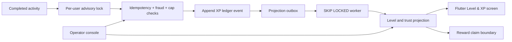

# Level / XP Progression — Native PostgreSQL Architecture

Date: 2026-08-09  
Status: Functional local implementation complete  
Runtime: Go BFF + Flutter + Django operator console + local PostgreSQL

## Product decisions

Progression rewards meaningful activity and never accepts money as a substitute
for behavior or trust. The cumulative thresholds are:

| Level | Name | XP | Trust gate |
|---:|---|---:|---|
| 1 | Onboarded | 0 | No |
| 2 | Active Starter | 100 | No |
| 3 | Reliable Participant | 250 | No |
| 4 | Conversation Builder | 500 | No |
| 5 | Trust Builder | 900 | Yes |
| 6 | Circle Contributor | 1,400 | Yes |
| 7 | Voice Confident | 2,100 | Yes |
| 8 | Social Connector | 3,000 | Yes |
| 9 | High-Quality Regular | 4,200 | Yes |
| 10 | Community Anchor | 6,000 | Yes |

L5-L10 require a verified, active, non-banned, non-frozen account in addition
to XP. Safety controls cannot be bypassed by rewards, experiments, or billing.

## Canonical XP policy

| Source | Base XP | Daily XP cap | Events/day | Cooldown |
|---|---:|---:|---:|---:|
| Profile completed | 50 | 50 | 1 | — |
| Daily prompt submitted | 20 | 20 | 1 | — |
| Mini activity completed | 30 | 90 | 3 | 5 minutes |
| Circle challenge submitted | 35 | 70 | 2 | 30 minutes |
| Voice icebreaker sent and played | 40 | 120 | 3 | 10 minutes |
| 3-day streak | 20 | 20 | 1 | — |
| 7-day streak | 60 | 60 | 1 | — |
| 14-day streak | 140 | 140 | 1 | — |

The global user-earned cap is 300 XP per day. Repeated activity uses
`1.00, 0.75, 0.50, 0.25` decay. A healthy verified account receives a bounded
1.10 quality multiplier. Risk controls can lower quality weighting to 0.50;
the combined quality multiplier is clamped to 0.50-1.25. Audited operator
corrections are exact compensating entries and do not participate in user caps,
experiments, or multipliers.

## Fraud and safety rules

- One immutable event per `(user, source, source_event_id)`.
- One command result per `(user, idempotency_key)` with a payload hash; key
  reuse with different content is rejected.
- Source event caps, per-source XP caps, cooldowns, repeated-action decay, and
  the global 300 XP cap are enforced under a per-user PostgreSQL advisory lock.
- Four rejected cap attempts in a day create or update a
  `repeated_source_cap` review case.
- Inactive, banned, suspended, or operator-frozen accounts cannot earn XP or
  claim rewards.
- Account risk multipliers are operator-attributed and constrained to 0.50-1.0.
- The ledger rejects `UPDATE` and `DELETE`; corrections require a signed
  positive or negative `admin_adjustment` entry and a reason.

Device/account graph scoring and cross-account fraud correlation are future
fraud-model inputs. The current rules are deterministic, bounded, and
operator-reviewable; no undocumented automated punishment is applied.

## PostgreSQL design

Migration `064_level_xp_progression.sql` creates schema `progression`:

- `level_definitions`, `xp_source_policies`, and `reward_catalog` are the
  operator-controlled catalogs.
- `xp_ledger` is the append-only source of truth, with identity sequence,
  event UUID, source-event uniqueness, idempotency uniqueness, actor, request
  hash, multiplier inputs, and covering timeline/daily indexes.
- `projection_outbox` decouples ledger commits from level computation.
- `user_level_state` is the query projection; `level_transitions` records each
  reached level exactly once.
- `reward_claims` guarantees one claim per user/reward and one result per
  idempotency key.
- `account_controls` and `fraud_cases` provide the safety/operator boundary.
- `experiments` and stable `experiment_assignments` provide cohort-safe XP
  weighting tests.
- `telemetry_events` records XP earned, level up, reward claim, cap, safety,
  recovery, acceleration, and fraud events.

All foreign-key access paths are indexed. Writes use short transactions and a
per-user advisory lock. Projection workers claim bounded batches with
`FOR UPDATE SKIP LOCKED`, retry with bounded backoff, dead-letter after eight
attempts, and recover stale processing leases after five minutes.

## Runtime flow



The profile-complete, daily-prompt/streak, mini-activity, circle-challenge, and
voice-play workflows emit stable source-event and idempotency identifiers. A
failed XP side effect does not fail the completed domain activity; it is logged
for repair while all accepted ledger writes remain durable.

## API and clients

Member routes:

- `GET /v1/progression/{userID}`
- `GET /v1/progression/{userID}/ledger`
- `POST /v1/progression/{userID}/rewards/claim`

Operator routes cover overview, source policies, fraud resolution, audited XP
adjustments, account controls, and experiment rollout. Every protected route
uses native bearer identity and ownership/RBAC middleware. Every mutation is
covered by shared PostgreSQL idempotency and documented in OpenAPI with typed
payloads.

Flutter exposes Level & XP in the Engagement hub, including progress, level
ladder, trust/freeze explanations, reward claims, and recent ledger activity.
The server-driven `level_progression_enabled` flag can disable the surface
without an app release. The Django console exposes policies, metrics,
experiments, fraud review, adjustments, and account controls.

## Rollout and observability

`xp_weighting_v1` starts in `draft` at 0%. Stable assignment uses a user/key
hash. Available variants are control, prompt-heavy, and voice/circle bonus.
The database now enforces 0% → dogfood 1% → 5% → 25% → general availability,
rejects skipped stages, and records every owner/evidence/decision transition.
A safety regression pauses the experiment; paused experiments retain cohort
assignments for analysis but runtime weighting stops immediately. No cohort can
remove caps or trust gates.

Pausing remains an attributed operator action. The cohort gate evaluates the
stored `safety_stop_report_rate` and fails on a breach or missing required
exposure. Prometheus then pages the named owner, and the reviewed operator route
records the pause. Automatic account punishment and undocumented automatic
rollout changes remain prohibited.

`backend/scripts/level_rollout_cohort_report.sh` is the stage-review gate that
closes this. For every variant of every `active` experiment it reports cohort
size, moderation reports against cohort members inside the window, the observed
rate, the configured threshold, current rollout percent, XP awarded, level-ups,
and open/confirmed fraud cases; it exits non-zero when any cohort exceeds its
threshold.

```bash
LEVEL_ROLLOUT_WINDOW_DAYS=7 backend/scripts/level_rollout_cohort_report.sh
```

Cohorts with no assigned members are reported `SAFETY STOP NOT PROVEN` rather
than passed, because a stage that produced no exposure is indistinguishable
from a safe one if only the rate is checked. Set
`LEVEL_ROLLOUT_REQUIRE_EXPOSURE=true` when attaching output as stage-gate
evidence, so an unexposed window fails instead of reading as a clean result.

Prometheus exports projection queue depth, processing, oldest age, completion
p95, dead letters, open fraud cases and 15-minute cap denials. A provisioned
Grafana dashboard and owner-labelled alert rules cover these signals. The
isolated local load gate processes 2,000 events with concurrent real workers and
checks ledger/projection equality. Production rollout still needs real cohort,
target-load, paging and safety-stop evidence; these are rollout evidence rather
than missing local behavior.

## Verification

`backend/scripts/verify_level_progression.sh` creates a username/password test
member and proves initial L1 state, exact admin award, same-key replay,
different-payload conflict, asynchronous L2 transition, once-only reward claim,
safety freeze enforcement, compensating adjustment, two-entry ledger history,
and append-only mutation rejection against local PostgreSQL.
