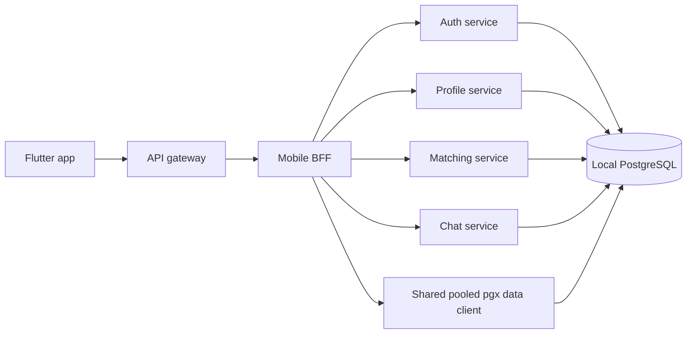

# Native PostgreSQL Runtime Conversion

Date: 2026-08-03  
Status: implemented and restart-verified for local mode

## Decision

Local mode uses PostgreSQL directly through pooled pgx connections. It does not
construct a Supabase/PostgREST client, does not start Supabase Realtime, and does
not silently fall back to process memory. Startup fails when PostgreSQL cannot
be opened or when a required repository is absent.

Remote-mode compatibility remains available behind `USE_LOCAL_DB=false`; it is
outside the local execution graph.

## Runtime composition



`dataaccess.Open` is the mode boundary. With `UseLocalDB=true`, it creates and
pings a `pgxpool.Pool`. BFF repositories receive the same process-wide data
client. Profile's transactional signup/security repository uses the pgx
`database/sql` driver, and billing reuses that transactional connection pool.

## Converted runtime surfaces

- Authentication, opaque sessions, recovery, and username identity
- Profile drafts, profile settings, photos, contacts, and blocks
- Discovery, swipes, mutual matches, and match state
- Persisted chat messages with a PostgreSQL transactional outbox, durable read
  cursors, and bearer-authenticated resumable WebSocket delivery; Supabase
  Realtime is disabled in local mode
- Safety reports, appeals, SOS, verification, and admin data
- Friends/social, trust badges/filters, activities, and conversation rooms
- Quest unlock, gestures, mini activities, nudges, calls, prompts, and groups
- Gifts, wallets, spotlight, master data, and terms agreements
- Billing plans, subscriptions, and payments

The production store is named `runtimeStore`. The legacy `memoryStore`
constructor exists only in `_test.go` compatibility code. Production BFF
composition forces durable mode in every environment even if the legacy opt-in
flag is false, and local startup validates every repository required by the
native runtime.

## PostgreSQL adapter guarantees

The direct adapter in `internal/platform/postgresdata` provides the repository
query contract over pgx while retaining bound parameters. It validates dynamic
identifiers, quotes identifiers, rejects unfiltered update/delete operations,
normalizes UUID/time/JSON values, uses a bounded pool, and supports PostgreSQL
upserts. Migration 053 adds the group columns and indexes required by the local
repository mappings and records its schema version.

## Verification evidence

The complete backend test suite passed:

```text
go test ./...
```

The final local stack was built and started with:

```text
./scripts/local_signup_stack.sh up
```

All six processes became ready: auth, profile, matching, chat, mobile BFF, and
API gateway. A completed user and a peer produced a mutual match, completed the
quest unlock workflow, and persisted a chat message. Additional writes covered
settings, an emergency contact, verification, a prompt answer, a community
group, an SOS alert, wallet coins, and a PostgreSQL billing transaction.

After stopping and rebuilding every service, the same bearer session remained
valid and the API returned the identical chat, subscription, and payment record
IDs. The post-restart database checkpoint was:

| Check | Persisted value |
|---|---|
| Settings theme | `dark` |
| Emergency contacts | `1` |
| Verification | `pending` |
| Prompt answers | `1` |
| Community groups | `1` |
| SOS alerts | `1` |
| Matches | `1` |
| Messages | `1` |
| Quest unlock | `conversation_unlocked` |
| Wallet balance | `12` |
| Subscription | `bronze:active` |
| Payment | `success` |

The current local service logs contain no Supabase, PostgREST, Supabase
Realtime, panic, fatal, or error entries. `public.schema_migrations` contains
`053_native_postgres_runtime`. Migration 054 adds the core dating realtime
outbox, read cursors, active-match/unread indexes, and match lifecycle fields.

## Operational commands

```text
./scripts/migrate_local_postgres.sh
./scripts/local_signup_stack.sh up
./scripts/local_signup_stack.sh status
./scripts/local_signup_stack.sh down
```

Do not provide Supabase variables for local mode. The authoritative local
connection is `DATABASE_URL` in `config/.env.local-postgres.example`.
