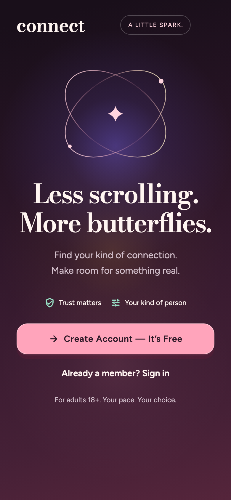
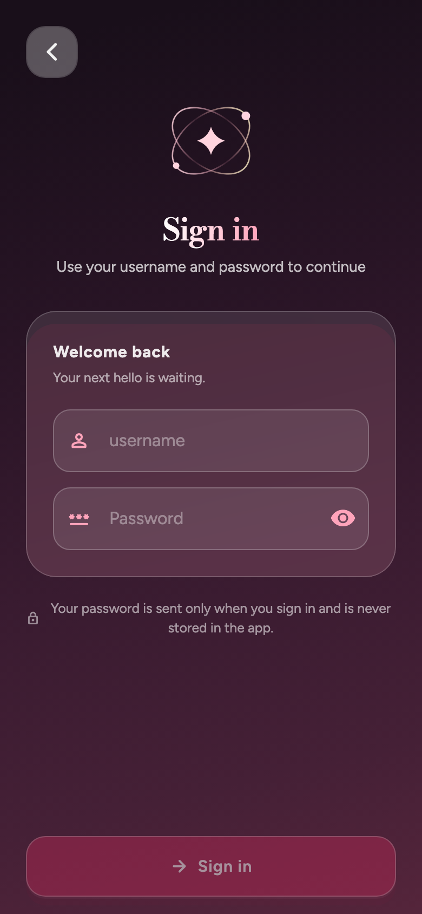
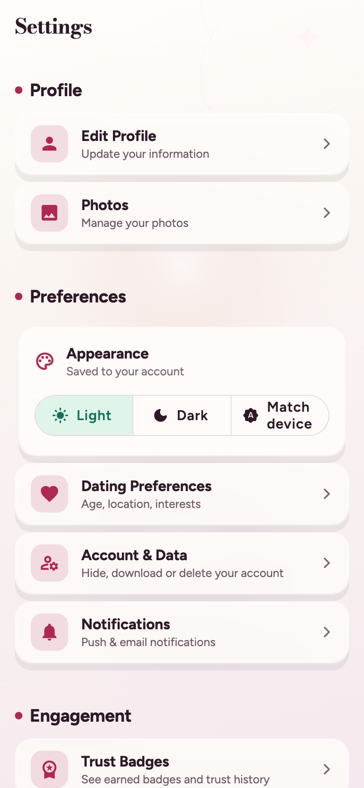
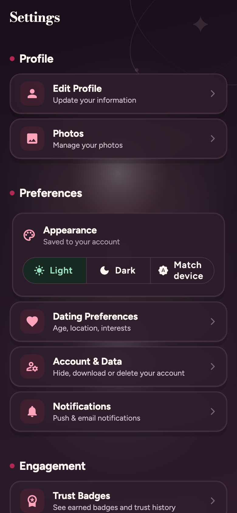
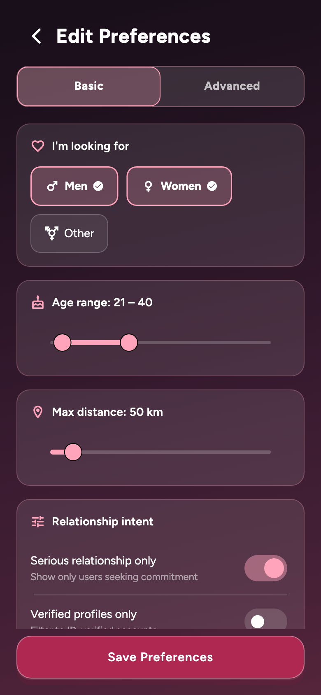

# Afterglow — Connect Android design system

Implemented 26 September 2026. A distinctive visual direction built for this app: wine-dark onboarding, warm ivory daytime surfaces, cherry actions and a pair of intersecting connection orbits. The existing product name remains Connect.

## Visual language

| Role | Light | Dark | Use |
|---|---|---|---|
| Ground | `#FAF5F1` | `#190F1A` | Calm backdrop, generous separation |
| Surface | `#FFFCF9` | `#2A1C29` | Cards, sheets, navigation |
| Main ink | `#2D1927` | `#FFF5F1` | Names, headings, body |
| Secondary ink | `#6F5967` | `#D2BFCB` | Supporting text |
| Primary action | `#AE2852` | `#FFA4BB` | One clear next action |
| Trust | `#15715D` | `#98E1C5` | Verification and positive status |
| Premium accent | `#C58C34` | `#EBC386` | Small, occasional highlights |

Bodoni Moda supplies expressive headlines and the wordmark. Figtree supplies readable controls, labels and body text. Both are already bundled for offline use. Avoid all-caps paragraphs and decorative display type in small controls.

The original, locally painted orbit motif is used prominently on welcome/login and faintly behind authenticated surfaces. It requires no downloaded image and has no continuously running animation. Do not put it behind dense text or compete with profile photography.

Use 12/18/24/32 px corner tokens, 52 px primary buttons, restrained shadows, and mostly opaque surfaces. Cherry is an action color, not a universal status color. Trust states also need a meaningful icon/label. Brightness must switch for the surface and its text together.

## Implemented scope

- Rebuilt welcome composition, original orbit artwork, headline, supporting copy and clear signup/sign-in hierarchy. Stable automation semantics remain.
- Refined login with the same motif, warmer copy and no automatic keyboard obstruction on entry.
- Rethemed Material controls and shared glass components: softer shapes, solid high-contrast actions, lower shadow intensity and readable surfaces.
- Applied active-theme card backgrounds across 36 screen files and corrected secondary text overrides in 17 files. Settings cards and bottom navigation now follow the selected theme.
- Refined discovery's header and invitation copy. Removed the misleading blanket “verified deck” label. Short displays scroll instead of compressing the content; card flipping is removed and like feedback is shorter.
- Improved preference selection and slider contrast on the dark form surface.
- Added appropriate Android system-bar icon brightness to shared backdrops and login.
- Page transitions and discovery like feedback respect reduced-motion settings. Shared action buttons expose their action and loading state to accessibility services.

Onboarding and preference forms intentionally retain their dark immersive surface. Authenticated surfaces support both light and dark themes. This is an app-wide theme and shared-component rollout with specific screen refinements, not a replacement of every screen's information architecture.

## Previews

These images are captured from the actual Flutter widgets at 390×844 logical pixels with bundled fonts and icons. Settings/preferences use deterministic synthetic fixtures; the Android emulator was also visually checked. Fixtures are not user data.

### Welcome

### Login

### Settings — light and dark

### Preferences

## Validation

- Full Flutter suite: **839 passed**, including contrast checks for primary labels and secondary surface text.
- Signed-in screen matrix: **531 passed** — 53 screens × five sizes × two themes, plus inventory guard.
- Welcome also passes the existing increased-text-size/small-phone check.
- Font/icon preview capture: **9 passed** (eight captures plus contrast test).
- Phone and tablet discovery golden baselines updated for the intentional visual changes after inspecting rendered output.
- Static analysis: no errors or warnings; existing and new informational lint findings remain.
- ARM64 debug APK built and installed on the isolated Android emulator (`emulator-5556`).
- Android device automation: **2 passed** — sign-in and saved-filter reopening, on the final APK. Evidence: `qa/results/2026-09-26-afterglow/android.xml`.

Evidence lives in `qa/results/2026-09-26-afterglow/`; the key preview images above are also retained alongside this document.

The layout matrix uses controlled fixtures and excludes unrelated plugin/network failures. It is not functional certification of every provider flow. Physical-device accessibility, TalkBack traversal, large-text behavior on every screen, frame-time profiling, and release-build acceptance still need dedicated validation. No claim of increased conversion, retention or engagement is made without product testing.
